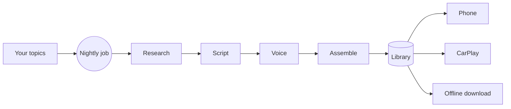

# Jarvis

**Your topics become short podcast episodes overnight — ready on your phone and in your car each morning.**

Give Jarvis a few things you're curious about. Each night the backend researches
them, writes a script, voices it, and assembles 2–3 short episodes. You wake up,
open the app (or just get in the car), and listen. Online or offline.

Jarvis is **model- and platform-agnostic**: the database, object storage, auth,
and the LLM / TTS / STT models all sit behind interfaces. You bring your own
backing services and your own model API keys — nothing is hardcoded to a vendor.

> **Status:** iOS V1 is feature-complete (onboarding, library, player, CarPlay,
> offline download, graceful failures). The nightly scheduler and own-model
> training are the active frontier — see the [roadmap](#roadmap).

---

## How it works



Generation always runs on the **backend**, never the phone. Episodes move through
`queued → researching → scripting → voicing → assembling → ready`, and the app
reflects each phase live.

- **Backend** — FastAPI, ports & adapters, SQLAlchemy + Alembic, OpenTelemetry.
  See [`backend/README.md`](backend/README.md) and
  [`backend/docs/ARCHITECTURE.md`](backend/docs/ARCHITECTURE.md).
- **iOS** — SwiftUI client, background audio, CarPlay, offline.
  See [`ios/README.md`](ios/README.md).

---

## Roadmap

**V1 — the loop (done / in progress)**
- Topic onboarding → overnight generation → library → player
- Background audio + lock-screen controls, **CarPlay**, **offline download**
- BYO provider keys (LLM/TTS), encrypted per-user at rest
- First-run "generate now" + live generation phases + user-friendly failure recovery
- Production-ready **nightly scheduler** (the overnight promise, running server-side) — *in progress*

**V2 — interact & ground**
- **Interactive Q&A via STT** — ask the episode a question; quota-limited, and the
  conversations become signal for recommendations
- **Research grounding / tools** — web search + arXiv and Medium MCP sources so
  episodes are current and cited

**V3 — personalization (Reinforcement Learning)**
- Learn a **taste persona** from plays, skips, completes, replays, and Q&A
- **Auto-curate** topics with an exploration/exploitation **contextual bandit** —
  balancing "more of what you love" against "something new"
- This is where the analytics data lake comes in (see
  [bring-your-own infrastructure](#bring-your-own-infrastructure))

**Later — own the models**
- Replace the BYO vendor **STT and TTS** with **our own trained models**, swapped
  in behind the existing `stt.py` / `tts.py` interfaces — no changes to the rest
  of the app

---

## Bring your own infrastructure

Fork it and run **your own** Jarvis. Nothing is tied to my accounts — you
provision your own backing services and select them with environment variables.
Copy [`backend/.env.example`](backend/.env.example) to `.env` and fill it in.

| Dependency | You provide | How it's wired | When |
|---|---|---|---|
| **Database** (Postgres) | A Supabase URL, RDS/Neon instance, or local Postgres | `DATABASE_URL` | Required |
| **Object storage** | An **S3 bucket** (note its **ARN** for IAM policies), R2/MinIO/Supabase S3 — or the local-disk default for dev | `STORAGE_PROVIDER` + `STORAGE_S3_BUCKET` / `STORAGE_S3_REGION` / keys | Required (local works out of the box) |
| **Encryption key** | A Fernet key (encrypts each user's BYO model keys at rest) | `KEY_ENCRYPTION_KEY` | Required |
| **JWT secret** | Any long random string | `JWT_SECRET` | Required |
| **Model API keys** | OpenAI / Anthropic / ElevenLabs keys | **Per user at runtime** via `PUT /me/keys` — never server env | Required to generate |
| **Observability** | An OTLP collector (or the bundled LGTM compose profile) | `OTEL_*` | Optional |
| **Analytics data lake** (V3) | An **S3 data lake** + **AWS Glue crawler** + Athena to catalog listening/feedback events for RL training | *(wired in the V3 personalization work)* | Future |

Generate the two secrets:

```bash
python -c "from cryptography.fernet import Fernet; print(Fernet.generate_key().decode())"  # KEY_ENCRYPTION_KEY
python -c "import secrets; print(secrets.token_urlsafe(48))"                                # JWT_SECRET
```

> **Design rule:** if you're about to `import openai` / `boto3` / `supabase`
> anywhere outside `app/adapters/<kind>/`, stop — add an adapter behind the
> interface instead. That's what keeps swapping a vendor (or dropping in our own
> models later) a one-line config change.

---

## Quickstart

**Backend**
```bash
cd backend
python3 -m venv .venv && source .venv/bin/activate
pip install -r requirements.txt
cp .env.example .env            # fill DATABASE_URL, KEY_ENCRYPTION_KEY, JWT_SECRET
alembic upgrade head
uvicorn app.main:app --reload   # http://localhost:8000/docs
```

**iOS** (Xcode 16+, `brew install xcodegen`)
```bash
cd ios
xcodegen generate && open Jarvis.xcodeproj   # ⌘R to run in the Simulator
```

Full details in [`backend/README.md`](backend/README.md) and
[`ios/README.md`](ios/README.md).

---

## Contributing

Work on a `feat/`, `fix/`, `test/`, or `docs/` branch and open a PR; CI
(migrations on real Postgres + hermetic pytest) must pass. Forks and PRs welcome.

## License

[MIT](LICENSE) — fork it, run it, make it your own.
