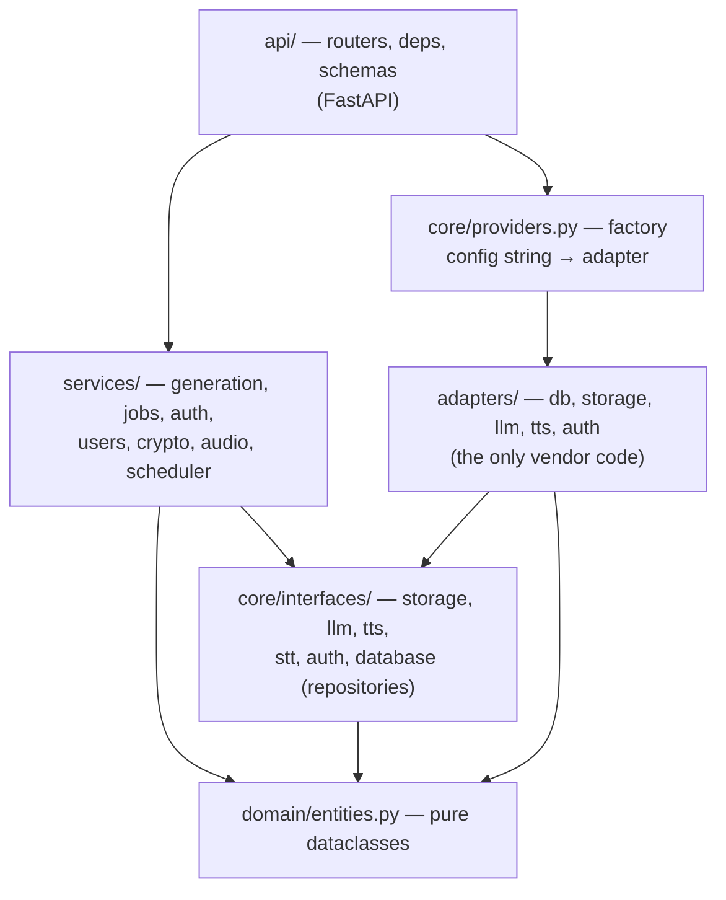
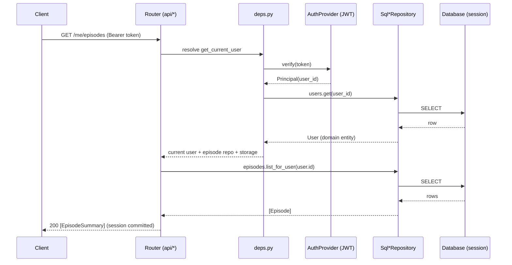
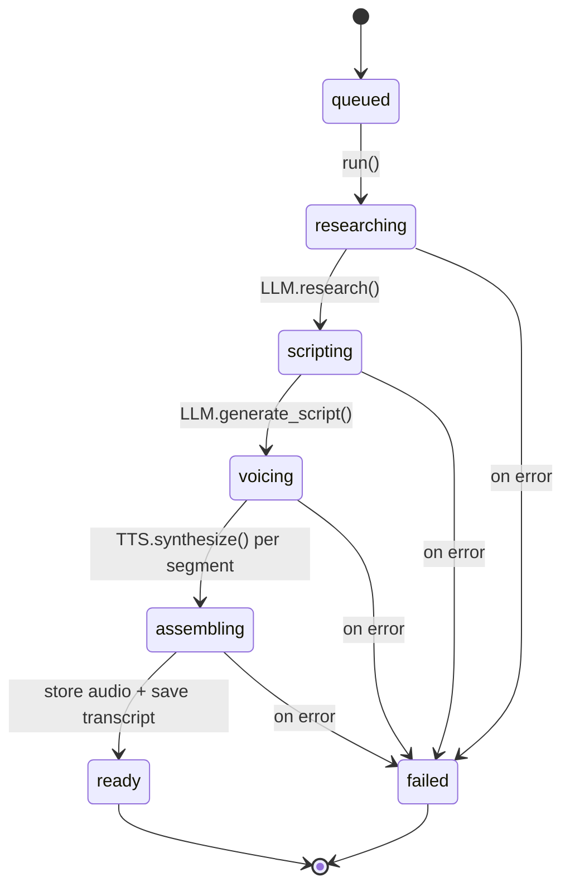
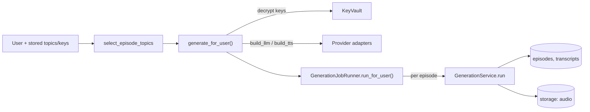

# Jarvis Backend — Architecture

How the backend works, in depth. Jarvis generates podcast episodes overnight
from a user's topics and serves them to a client. This document explains the
layering, the request and generation lifecycles, the data model, and how to
extend the system.

> New here? Read **Design principles** and **Layered architecture** first, then
> jump to whatever you're touching. The **Extending the backend** recipes at the
> end are the fastest path to a first change.

## Contents

- [Design principles](#design-principles)
- [Layered architecture](#layered-architecture)
- [Directory map](#directory-map)
- [Request lifecycle](#request-lifecycle)
- [The agnostic seam: interfaces, adapters, factory](#the-agnostic-seam-interfaces-adapters-factory)
- [Domain and data model](#domain-and-data-model)
- [Auth and secrets](#auth-and-secrets)
- [The generation pipeline](#the-generation-pipeline)
- [Storage](#storage)
- [Observability](#observability)
- [Configuration](#configuration)
- [Running the backend](#running-the-backend)
- [Testing strategy](#testing-strategy)
- [Extending the backend](#extending-the-backend)

---

## Design principles

**Platform-agnostic, not just model-agnostic.** The database, object storage,
auth, and the LLM/TTS/STT models all sit behind interfaces. A vendor (Supabase,
S3, OpenAI, ElevenLabs…) is chosen by an environment variable and implemented in
exactly one adapter. Nothing else in the codebase imports a vendor SDK.

**Ports and adapters (hexagonal).** The core — domain entities and the services
that orchestrate them — depends only on *interfaces* (ports). Concrete
implementations (adapters) are plugged in at the edge. This is what lets the
whole data layer run on SQLite in tests and Postgres in production without a
code change.

**One design rule that enforces it all:**

> If you're about to `import openai` / `boto3` / `supabase` / `anthropic`
> anywhere outside `app/adapters/<kind>/`, stop — add an adapter behind the
> interface instead.

---

## Layered architecture

Dependencies point inward. The domain and interfaces know nothing about FastAPI,
SQLAlchemy, or any vendor; adapters and the API layer depend on them.



The **dependency rule**: `domain` imports nothing from the app; `core/interfaces`
imports only `domain`; `services` import `core` + `domain`; `adapters` implement
`core` and may import vendors; `api` wires everything through `core/providers`
and `api/deps`.

---

## Directory map

```
app/
  config.py              # typed settings from env — the one home for vendor choices
  main.py                # FastAPI entry: logging, routers, telemetry, /media
  observability.py       # logging + OpenTelemetry (logs, traces, metrics)

  core/
    interfaces/          # the ports — everything codes against these
      storage.py         #   StorageProvider
      llm.py             #   LLMProvider + Script/ResearchBrief value objects
      tts.py             #   TTSProvider
      stt.py             #   STTProvider (V2 Q&A)
      auth.py            #   AuthProvider + Principal
      database.py        #   6 repository interfaces
    providers.py         # factory: build_storage / build_llm / build_tts / build_auth

  domain/
    entities.py          # User, Episode, Transcript, FeedbackEvent, Conversation,
                         # TopicSignal + status/type enums (no ORM, no vendor types)

  adapters/              # concrete implementations — the only vendor code
    db/
      models.py          #   SQLAlchemy ORM tables
      session.py         #   async engine + session factory + get_session dependency
      repositories.py    #   Sql* repositories: rows <-> domain entities
    storage/local.py     #   LocalStorageProvider
    llm/{openai,anthropic}.py
    tts/{openai,elevenlabs}.py
    auth/jwt.py          #   JWTAuthProvider

  services/              # orchestration — pure, testable with fakes
    crypto.py            #   KeyVault: Fernet encrypt/decrypt of BYO keys
    users.py             #   onboarding: topics + provider keys
    auth.py              #   signup/login, bcrypt, JWT issuance
    audio.py             #   assemble per-segment audio + estimate duration
    generation.py        #   the episode state machine
    jobs.py              #   job runner + per-user orchestration
    scheduler.py         #   APScheduler nightly batch

  api/
    deps.py              # session -> repositories -> services -> current user
    schemas.py           # pydantic request/response models (the wire contract)
    auth.py users.py episodes.py feedback.py   # routers

alembic/                 # migrations (schema lives in the repo, not a dashboard)
tests/                   # hermetic (SQLite) + fakes
```

---

## Request lifecycle

Every authenticated request flows the same way. Dependencies are resolved by
FastAPI, a single DB session is opened per request and committed on success.



`get_session` (in `adapters/db/session.py`) yields one `AsyncSession` per
request and commits on clean exit, rolls back on exception. FastAPI caches each
dependency per request, so every repository in a request shares that one session
and transaction.

---

## The agnostic seam: interfaces, adapters, factory

Three pieces make a vendor swappable:

1. **An interface** in `core/interfaces/` — an abstract base class the rest of
   the code depends on. Example: `StorageProvider.put/get/url/delete`.
2. **One or more adapters** in `adapters/<kind>/` implementing it.
3. **A factory arm** in `core/providers.py` that maps a config string to an
   adapter — the *only* place a vendor name becomes a concrete class:

```python
def build_llm(provider: str, api_key: str, model: str | None = None) -> LLMProvider:
    match provider:
        case "openai":
            from app.adapters.llm.openai import OpenAILLMProvider
            return OpenAILLMProvider(api_key, model or "gpt-4o-mini")
        case "anthropic":
            from app.adapters.llm.anthropic import AnthropicLLMProvider
            return AnthropicLLMProvider(api_key, model or "claude-opus-4-8")
        ...
```

Services receive an interface and never learn which implementation they got.
`GenerationService`, for instance, takes an `LLMProvider` and a `TTSProvider` as
arguments — the caller (the job runner) builds them from the user's stored keys.

The imports are **lazy** (inside each `case`) so only the selected vendor's
dependency is loaded, and a missing optional dependency never breaks startup.

---

## Domain and data model

`domain/entities.py` holds plain dataclasses — no ORM, no vendor types. The DB
adapter maps its rows to and from these, so the domain stays pure.

| Entity | Purpose | Key fields |
| --- | --- | --- |
| `User` | account + onboarding + BYO keys | `email`, `password_hash`, `onboarding_topics`, `provider_keys_encrypted`, `daily_question_quota` |
| `Episode` | the generated artifact | `topics`, `status`, `title`, `audio_key`, `duration_seconds`, `error` |
| `Transcript` | grounds V2 Q&A; show notes/search | `episode_id`, `segments[]` |
| `FeedbackEvent` | implicit taste signal (V3) | `type`, `position_seconds` |
| `Conversation` | explicit intent signal (V2) | `question_text`, `answer_text` |
| `TopicSignal` | the evolving persona (V3) | `topic_cluster`, `weight`, `source` |

Enums: `EpisodeStatus`, `FeedbackType` (`play/skip/complete/replay/thumb_*`),
`SignalSource` (`behavior/question`). Enums are stored as strings in the DB for
portability.

### Repositories

Persistence is behind six repository interfaces in `core/interfaces/database.py`;
`adapters/db/repositories.py` implements them with SQLAlchemy. Each method
translates between ORM rows and domain entities — the only module that imports
both. Services depend on the interfaces, so swapping the store means writing a
new adapter, not touching services.

### Migrations

Schema is managed with **Alembic**. `alembic/env.py` reads `DATABASE_URL` from
the app's settings (single source of truth) and targets `Base.metadata`. Portable
column types (JSON for lists, strings for enums, timezone-aware timestamps) keep
migrations valid on any SQLAlchemy engine.

```bash
alembic upgrade head                             # apply
alembic revision --autogenerate -m "message"     # after changing models
```

---

## Auth and secrets

**Identity.** `AuthProvider.verify(token) -> Principal` is the port; `JWTAuthProvider`
is the adapter (PyJWT, HS256). `AuthService` (in `services/auth.py`) is the write
side: `signup`/`login` with bcrypt password hashing and access-token issuance.
Routes depend on `get_current_user` (in `api/deps.py`), which turns a
`Authorization: Bearer` header into a verified `User`.

**BYO provider keys.** Users bring their own LLM/TTS API keys. They are:

- **encrypted at rest** with Fernet (`services/crypto.py::KeyVault`) using
  `KEY_ENCRYPTION_KEY`, stored in `users.provider_keys_encrypted`,
- **never returned** by any endpoint (`GET /me` exposes provider *names* only),
- **decrypted only in memory** during a generation run, to build the provider.

Two secrets protect the system: `KEY_ENCRYPTION_KEY` (user keys) and `JWT_SECRET`
(tokens). Both come from the environment and never touch the repo.

---

## The generation pipeline

Generation runs **on the backend, never the phone** — iOS cannot reliably render
a full episode while asleep. `GenerationService.run` (in `services/generation.py`)
drives one episode through a state machine, updating its row at each step and
marking it `FAILED` with the reason on any error.



The service depends only on interfaces — the caller passes already-built
`LLMProvider`/`TTSProvider` adapters, which keeps it unit-testable with fakes and
swappable in production.

### From a user to episodes (the job runner)

`services/jobs.py` is the composition layer for a run:



- `select_episode_topics(user, count)` — the V1 policy: one episode per interest,
  capped at `DEFAULT_EPISODES_PER_NIGHT`. The V3 bandit replaces this.
- `generate_for_user(...)` — decrypts the user's keys, builds their configured
  LLM/TTS adapters (builders injected for testability), and runs the batch. A
  user with no key for the default provider is skipped.
- `GenerationJobRunner.run_for_user` — creates episode rows and drives each
  through `GenerationService`, isolating a per-episode failure so one bad topic
  doesn't sink the batch.

### Triggering

- **CLI:** `python -m app.cli --user <id>` or `--all`.
- **Nightly:** `python -m app.services.scheduler` runs `run_for_all` on a cron
  (APScheduler, 04:00 local). Both paths call the same coroutine.

---

## Storage

`StorageProvider` abstracts audio blobs: `put/get/url/delete` by key.
`LocalStorageProvider` writes under a base dir and serves via `/media/<key>`
(mounted in `main.py` for local dev). S3 and Supabase adapters slot in behind the
same interface; `url()` returns a signed/time-limited URL where supported, so the
library API's `audio_url` works identically across backends.

---

## Observability

`app/observability.py` separates two concerns:

- **`configure_logging`** (always on) — one stdout handler, level from
  `LOG_LEVEL`, **text or JSON** via `LOG_FORMAT`. Uvicorn, SQLAlchemy, APScheduler,
  and httpx loggers are routed through the root handler; SQLAlchemy echo is
  quieted. Application code just calls `logging.getLogger(__name__)`.
- **`configure_telemetry`** (gated by `OTEL_ENABLED`) — OpenTelemetry **logs,
  traces, and metrics** over OTLP/HTTP (or console export for local debugging).
  Auto-instruments FastAPI (request spans + HTTP metrics), SQLAlchemy (query
  spans), and httpx (provider-call spans). `LoggingInstrumentor` stamps
  `trace_id`/`span_id` onto log records, so a JSON log line correlates to its
  trace.

Disabled by default, so local dev and tests need no collector. Point
`OTEL_EXPORTER_OTLP_ENDPOINT` at any OTLP/HTTP collector (Grafana Alloy, the
OTel Collector, Honeycomb, etc.) to ship signals.

---

## Configuration

All configuration is environment-driven through `config.py` (`pydantic-settings`),
read once via a cached `get_settings()`. Every vendor choice is a value here, not
a hardcoded import. See `.env.example` for the full list; the essentials:

| Variable | Purpose |
| --- | --- |
| `DATABASE_URL` | any Postgres-compatible URL (also SQLite in tests) |
| `STORAGE_PROVIDER` | `local` \| `s3` \| `supabase` |
| `AUTH_PROVIDER` | `local`/`jwt` \| `supabase` |
| `KEY_ENCRYPTION_KEY` | Fernet key for BYO provider keys |
| `JWT_SECRET` | access-token signing secret |
| `DEFAULT_LLM_PROVIDER` / `DEFAULT_TTS_PROVIDER` | provider selected for generation |
| `LOG_LEVEL` / `LOG_FORMAT` | logging verbosity and format |
| `OTEL_ENABLED` / `OTEL_EXPORTER_OTLP_ENDPOINT` | observability export |

---

## Running the backend

```bash
# Local (SQLite or a local Postgres)
python3 -m venv .venv && source .venv/bin/activate
pip install -r requirements.txt
cp .env.example .env          # set KEY_ENCRYPTION_KEY and JWT_SECRET
alembic upgrade head
uvicorn app.main:app --reload # http://localhost:8000/docs

# Full stack with real Postgres
docker compose up --build     # migrations run on boot

# Generation
python -m app.cli --all               # nightly batch, now
python -m app.services.scheduler      # long-lived cron process
```

Generate the encryption key: `python -c "from cryptography.fernet import Fernet;
print(Fernet.generate_key().decode())"`.

---

## Testing strategy

- **Hermetic.** `tests/conftest.py` points the app at a throwaway SQLite file and
  sets test secrets *before* any app import, then creates the schema once. Because
  the data layer is engine-agnostic, the full HTTP stack runs on SQLite unchanged.
- **Fakes over mocks.** Pipeline and job tests use in-memory repositories and fake
  LLM/TTS providers, so they assert real behavior (state transitions, isolation,
  outputs) without network or keys.
- **Adapter tests** use `httpx.MockTransport` to assert request shape and response
  parsing for the OpenAI/Anthropic/ElevenLabs adapters — offline.
- **CI** (`.github/workflows/ci.yml`) additionally applies migrations against a
  **real Postgres** service, proving the schema is valid on the production engine,
  then runs the suite.

Run: `python -m pytest -q`.

---

## Extending the backend

**Add a provider (e.g. a Gemini LLM):**
1. Create `adapters/llm/gemini.py` implementing `LLMProvider`.
2. Add a `case "gemini":` arm to `build_llm` in `core/providers.py`.
3. Add a `MockTransport` test in `tests/test_providers.py`.
   Nothing in `services/` changes.

**Add an endpoint:**
1. Add request/response models to `api/schemas.py`.
2. Add a dependency to `api/deps.py` if it needs a new repository/service.
3. Write the router in `api/<feature>.py` and include it in `main.py`.
4. Test it over the HTTP stack in `tests/test_<feature>.py`.

**Add a table:**
1. Add the domain dataclass to `domain/entities.py`.
2. Add the ORM model to `adapters/db/models.py` and a repository interface +
   implementation.
3. `alembic revision --autogenerate -m "add <table>"`, review, and verify it
   applies up and down.

**Swap the database or storage:** change `DATABASE_URL` or `STORAGE_PROVIDER` — no
code change for Postgres hosts; a new adapter for a genuinely different backend.

---

*Roadmap: V1 (this backend) → V2 interactive voice Q&A (STT, conversations) → V3
persona + exploration/exploitation curation → V4 in-house TTS/STT. The
`conversation` and `topic_signal` entities and the `feedback_events` log already
exist so the signal is captured from day one.*
